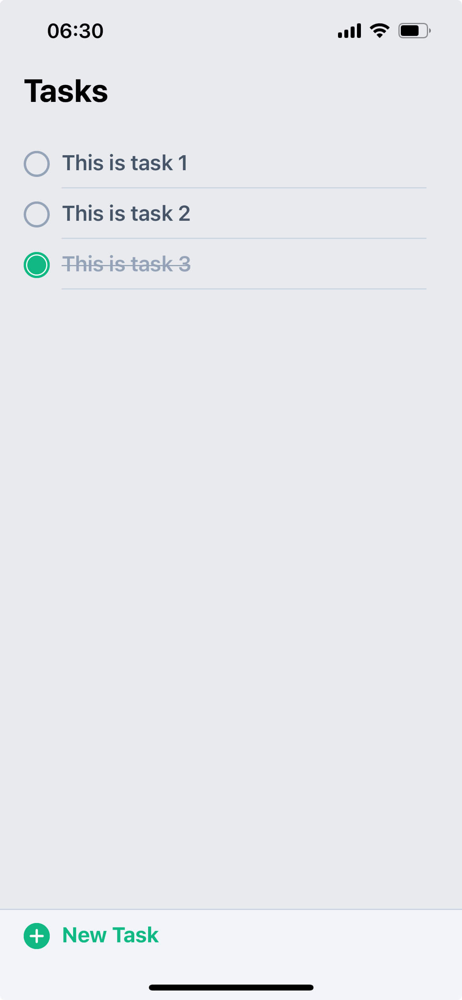

# React Native Todo List App

This is a simple todo list app built with React Native.

> Note: This app is built with Expo, so you will need to have the Expo CLI installed to run it
> Note: This app is still a work in progress...

#### Screenshot

## Installation

1. Clone the repo
2. Run `npm install` to install the dependencies
3. Run `npm start` to start the app
4. Open the Expo app on your phone and scan the QR code
5. Enjoy!

## Resources

- [React Native](https://reactnative.dev/)
- [Expo Documentation](https://docs.expo.io/)
- [Download Expo App](https://expo.dev/client)

## License

- [MIT](LICENSE.md)
